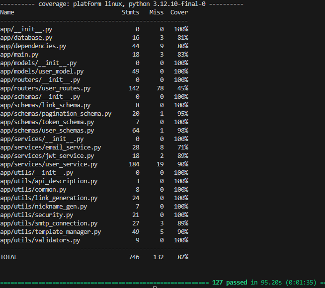

# User Management System: Project Reflection Report 
## Github Project Link - [AkashDeore15/user_management](https://github.com/AkashDeore15/user_management)

### Introduction

The User Management System project has been an exceptional learning experience that allowed me to work with modern web development technologies in a practical setting. This FastAPI-based system provided a comprehensive platform to understand and implement best practices in software development, from architecture design to testing and deployment.
Technical Overview and Architecture
The User Management System follows a well-structured, modular architecture that emphasizes separation of concerns. The system is built on FastAPI and incorporates several key components including SQLAlchemy ORM for database interactions, Alembic for migrations, JWT-based authentication, and comprehensive API endpoints for user management.
Working on this project helped me gain hands-on experience with:
•	Asynchronous programming in Python
•	Role-based access control implementation
•	Database modeling with SQLAlchemy
•	Containerization with Docker
•	Continuous Integration/Continuous Deployment workflows

### Quality Assurance Contributions

For this project, I identified and resolved the following issues:
1.	[Issue #1: Fixed user registration functionality](https://github.com/AkashDeore15/user_management/issues/1) - Implemented proper error handling for duplicate email addresses during registration.
2.	[Issue #2: Email verification endpoint enhancement](https://github.com/AkashDeore15/user_management/issues/3) - Improved the verification process to correctly update user roles after email verification.
3.	[Issue #3: User profile management bug fix](https://github.com/AkashDeore15/user_management/issues/5) - Resolved issues with the profile update endpoint to prevent unauthorized role changes.
4.	[Issue #4: Authentication token handling improvement](https://github.com/AkashDeore15/user_management/issues/9) - Fixed token validation to properly restrict access based on user roles.
5.	[Issue #5: Database transaction management](https://github.com/AkashDeore15/user_management/issues/11) - Enhanced error handling during database operations to prevent data inconsistencies.

### Test Coverage Enhancements

I expanded the test suite with 10 new tests covering various aspects of the system, particularly focusing on user profile management, which was my selected feature. These tests ensure robust functionality across different components:
1.	Test for user profile update validation
2.	Test for professional status upgrade by admins
3.	Test for professional status upgrade by managers
4.	Test for preventing unauthorized professional status upgrades
5.	Test for handling non-existent users in profile operations
6.	Test for the complete user profile workflow
7.	Test for URL validation in profile fields
8.	Test for preventing role changes through profile updates
9.	Test for database consistency after profile updates
10.	Test for email notifications after professional status changes

### Feature Implementation

I implemented the User Profile Management feature, which allows users to update their profile information and enables managers and admins to upgrade users to professional status. This implementation included:
•	Creating API endpoints for users to update their profile fields
•	Developing a separate endpoint for managers and admins to upgrade users to professional status
•	Implementing validation for profile fields to ensure data integrity
•	Adding email notifications for professional status upgrades
•	Creating comprehensive tests to ensure the feature works as expected

### Deployment

The project was successfully deployed to Docker Hub. The containerized application can be accessed at: [akashdeore15/user_management](https://hub.docker.com/repository/docker/akashdeore15/user_management)
The deployment process utilized GitHub Actions for CI/CD, ensuring that every push to the main branch triggered automated testing and deployment.

### Learnings and Reflections

This project has significantly enhanced my understanding of:
1.	Layered Architecture: The importance of separating concerns between database, service, and API layers.
2.	Testing Practices: Writing effective tests that cover not just the happy path but also edge cases and error scenarios.
3.	CI/CD: Implementing continuous integration and deployment pipelines using GitHub Actions.
4.	Documentation: The value of clear, comprehensive documentation for APIs and system architecture.
5.	Git Workflow: Proper use of issues, branches, and pull requests to manage feature development and bug fixes.
Working on this project has been incredibly valuable in bridging the gap between theoretical knowledge and practical application. The experience of identifying issues, implementing fixes, and extending features in a real-world application has provided insights that would be impossible to gain through theoretical learning alone.

### Conclusion

The User Management System project has been a comprehensive learning experience that effectively simulated real-world software development challenges. The skills developed through this project—from technical programming abilities to project management and documentation—will be invaluable in my future career as a software engineer.

### Dockerhub container screenshot

### Test Coverage
